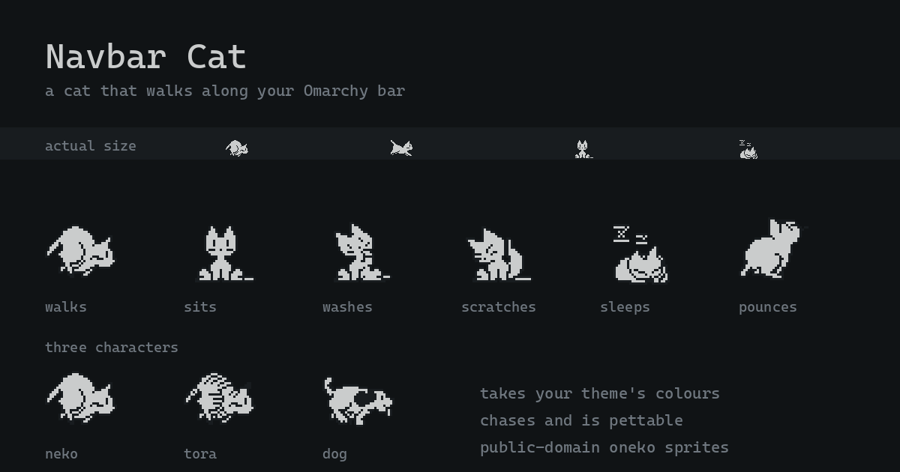

# Navbar Cat

A cat that walks along the Omarchy bar.

It roams the full width of the bar, reacts to what your machine is doing, takes
your theme's colours, and can be petted. The sprites are the original
[oneko](http://www.daidouji.com/oneko/) cat, and so is the behaviour: left
alone, it sits, washes its face, scratches its head, yawns, and only then falls
asleep.



## What it does

| When | The cat |
|---|---|
| You move the pointer onto the bar | runs to it, then **pounces** at it |
| You switch workspace | scampers in the direction you switched |
| You plug in the charger | gets drowsy and naps where it is |
| Something is playing | dances on the spot |
| You leave for a few minutes | settles down and falls asleep |
| It has been asleep a while | gets up, potters about, and settles again |
| Nothing in particular | wanders, with pauses |
| You click it | looks up at you, then grooms |

It walks the long way round on vertical bars too, and claws at the ends of the
bar when it wants to keep going and can't.

Those reactions are a priority order, not a list — the first one that applies
wins. Anything that wakes the cat beats anything that puts it to sleep:

```
petted  >  pointer  >  workspace  >  music  >  charging  >  idle  >  wander
└──────────── awake ────────────┘   └───── asleep ─────┘
```

So music still gets the cat bobbing while you are on mains power, but moving
your pointer to the bar interrupts it — the cat would rather come to you.

## Characters

Three sprite sets ship, all from oneko and all with the same 32 frames:

| `character` | |
|---|---|
| `neko` (default) | the original cat |
| `tora` | tiger-striped cat — the stripes take your theme's ink colour |
| `dog` | a dog, for people who are wrong about cats |

## Install

```bash
omarchy plugin add https://github.com/tallsam/omarchy-navbar-cat.git --enable --yes
```

Or by hand:

```bash
git clone https://github.com/tallsam/omarchy-navbar-cat.git \
  ~/.config/omarchy/plugins/io.github.tallsam.navbar-cat
omarchy-shell shell rescanPlugins
omarchy plugin enable io.github.tallsam.navbar-cat
```

### Requirements

Omarchy 4 (Quattro) or newer, and `python3` — which Omarchy already installs.
Nothing else: no system packages, no build step, no network access, and nothing
outside the plugin's own directory.

### Removal

```bash
omarchy plugin remove io.github.tallsam.navbar-cat
```

Or by hand:

```bash
omarchy plugin disable io.github.tallsam.navbar-cat
rm -rf ~/.config/omarchy/plugins/io.github.tallsam.navbar-cat
omarchy-shell shell rescanPlugins
```

Disabling removes the plugin's entry from `~/.config/omarchy/shell.json`, which
takes your settings with it. The cat leaves nothing else behind: it writes no
files, no state, and no config of its own, and its helper process exits with
the shell.

## Configuration

Settings go inline on the plugin's entry in `~/.config/omarchy/shell.json`:

```json
{
  "plugins": [
    {
      "id": "io.github.tallsam.navbar-cat",
      "character": "neko",
      "speed": 1.0,
      "size": 16,
      "pettable": true,
      "chaseCursor": true,
      "pounce": true,
      "avoidCenter": 0.2,
      "sleepAfter": 180,
      "stirEvery": 150,
      "stirFor": 25,
      "monitor": "focused",
      "reactions": { "music": true, "charging": true, "workspace": true }
    }
  ]
}
```

| Key | Default | Meaning |
|---|---|---|
| `character` | `"neko"` | `neko`, `tora`, or `dog` |
| `speed` | `1.0` | Multiplier on walking and running pace |
| `size` | `16` | Cat height in logical pixels |
| `pettable` | `true` | Whether the cat can be clicked |
| `chaseCursor` | `true` | Whether the cat comes when you visit the bar |
| `pounce` | `true` | Whether it leaps at the pointer (see below) |
| `avoidCenter` | `0.2` | Fraction of the bar's middle to keep clear of the clock; `0` disables |
| `sleepAfter` | `180` | Seconds of pointer stillness before it sleeps |
| `stirEvery` | `150` | Roughly how often a sleeping cat gets up, in seconds |
| `stirFor` | `25` | How long it potters about before settling again |
| `monitor` | `"focused"` | `"focused"` to follow you, or an output name to pin it |
| `reactions` | all on | Individually disable the music, charging, or workspace reactions |

### About the pounce

When the cat catches up with your pointer it leaps at it, arcing out of the bar
and back. This is the one behaviour that draws outside the bar: the overlay is
grown by half a cat's height so there is somewhere to leap into, and for those
600ms the cat is painted over whatever is behind the bar.

The extra strip is transparent and carries no input region, so it changes
nothing else — but if you want the cat strictly confined to the bar, set
`pounce: false` and the window shrinks back to exactly the bar's height.

It leaps *into* the screen whichever edge your bar is docked to, so on a bottom
bar it jumps up rather than off the screen.

## Does it get in the way?

No. The overlay is click-through everywhere the cat is not, and while the cat
is *moving* it is click-through everywhere at all — the small clickable box
only exists once the cat has settled somewhere, and disappears the moment it
sets off again. Set `pettable: false` to remove even that.

It costs almost nothing at rest, either: a sleeping cat stops its own render
timer, and the pointer sampler slows down to match.

## How it is put together

| File | Role |
|---|---|
| `Cat.qml` | The panel: window, monitor tracking, event sources, tick loop |
| `CatSprite.qml` | Frame selection, sheet choice, two-tone theming |
| `Brain.js` | All the behaviour, as a pure function — the tested part |
| `bin/navbar-cat-cursor` | Pointer sampler |
| `tools/build-sprites.py` | XBM → spritesheets (only needed to change the art) |
| `tools/build-preview.py` | Renders `preview.png` from the shipped sheets |

`Brain.js` takes a snapshot of the world and returns what the cat should be
doing. It holds no QML and reads no clock of its own, so the whole priority
ladder is testable with a fake clock:

```bash
node --test "test/*.test.mjs"
```

### Two things worth knowing

**The pointer is sampled, not subscribed to.** Hyprland has no cursor-move
event and Quickshell exposes no pointer position, so something has to ask.
Asking via `hyprctl` costs ~8ms per sample — 8% of a core at 10Hz, which is an
absurd price for a cat. `bin/navbar-cat-cursor` makes the same request straight
to the Hyprland socket for ~0.03ms, which is 285× cheaper and the reason this
feature exists at all.

**The cat does not know where your widgets are.** Nothing in the bar exposes
widget geometry, so the cat cannot see your clock — it only assumes one is
there. Omarchy centres the clock by default, so the spots the cat *chooses*
for itself keep clear of the middle fifth of the bar. It still walks straight
through the middle, and it will still come to the middle if that is where you
put your pointer; it just will not settle down or fall asleep on top of your
clock. If your clock lives somewhere else, set `avoidCenter: 0`.

## Sprites and licence

The plugin's own code is MIT. The sprites are the **public-domain** `neko`,
`tora`, and `dog` sets from oneko 1.2.sakura.5 — see
[`vendor/oneko/PROVENANCE.md`](vendor/oneko/PROVENANCE.md) for the exact source
and checksum.

oneko's tarball also ships character sets that are **not** free — the BSD
Daemon is Marshall Kirk McKusick's, and Sakura and Tomoyo are CLAMP characters.
None of those are vendored here.
